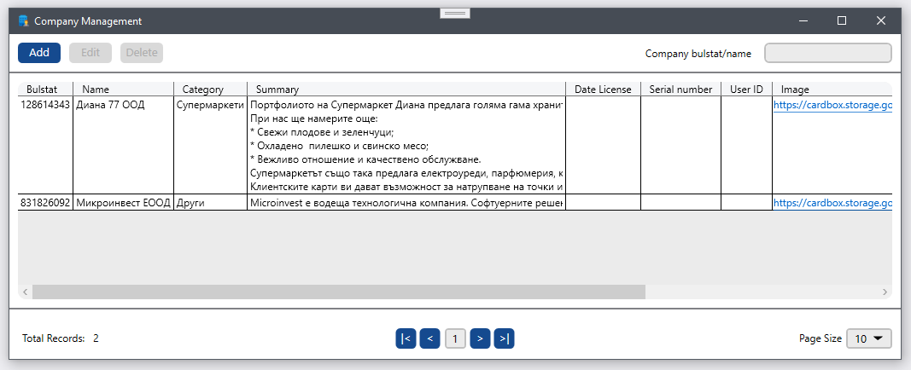
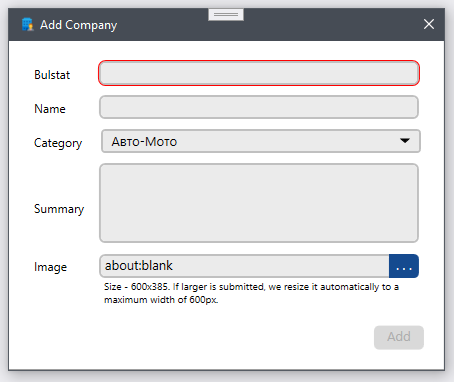
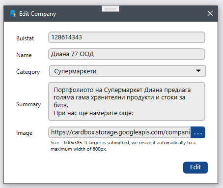

# CardBox Company Management

An WPF application for CRUD operations with a third-party API and own database.





## Description

In this application, I used the MVVM pattern, DependencyInjection, HttpClient, SqlClient, pattern Wrapper(decorator).

You are can use this project how example for process, add, delete (modal windows) display information from third-party services (data grid).

And example of working with a WPF table: 
* search 
* paging 
* sorting 
* various types of data in columns (include links) 
* formatting default UI components
* another features

## Getting Started

### Dependencies

.NET 6.0 Runtime

### Installing

* Clone to your PC.
* Create class ConnectionStrings.cs in CardBox.MPortalDataBaseClient and use your connections strings. 
* If you wanna get only one executing file use this cmd command: 
``` 
dotnet publish -c Release -r win-x86 -p:PublishReadyToRun=true -p:PublishSingleFile=true --self-contained false -p:IncludeNativeLibrariesForSelfExtract=true
```
## Authors

Chepets Serhii <br /> 
Contacts: [LinkedIn](https://www.linkedin.com/in/serhii-chepets-412b46223/) / [GitHub](https://github.com/SaintZet) / [Telegram](https://t.me/SaintZet)

## Version History

* v1.0.0
    * Initial Release

## License

This project is licensed under the GNU AGPLv3 License - see the LICENSE.md file for details

## Acknowledgments

* [WPF-Paging-DataGrid](https://github.com/WyoMetz/Paging-WPF-DataGrid)
* [WPF-Files-Structure](https://github.com/SingletonSean/SimpleTrader)
* [WPF-Crud-Control](https://github.com/GenericCodes/WPFCrudControl)
